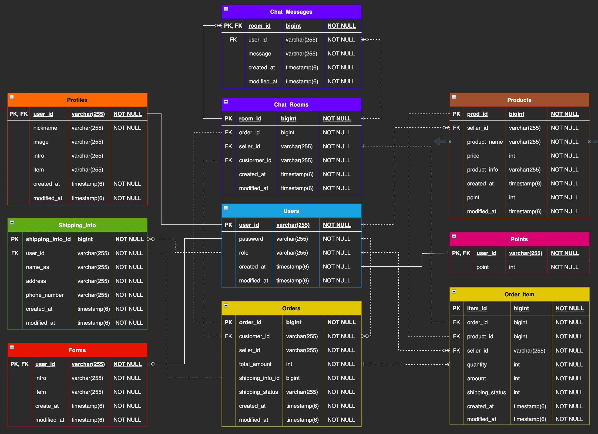
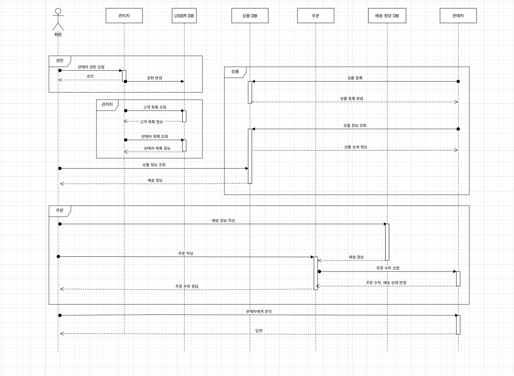

# 내일배움캠프 4기 Spring 팀프로젝트

## 매칭 서비스 프로젝트

___

___

### 개발 환경
- JDK : 17
- Spring Boot : 3.0.1

### Team
- 팀장 : 한정규
- 팀원 : 김현중, 예진선, 이은섭, 조용연

___

## 요구사항
1. 회원가입 / 로그인 / 로그아웃 / 토큰 기능
2. 유저 권한 기능
- 유저는 총 3가지 권한으로 나뉜다.
  - 고객 : 최초 가입한 유저
  - 판매자 : 판매자 승인을 받은 고객
  - 운영자 : 판매자 승인을 해주는 유저
3. 유저 권한별 기능

고객

- 조회 
  - 나의 프로필 설정 및 조회 
  - 전체 판매상품 목록 : 판매 상품목록을 페이징하며 조회 
  - 전체 판매자 목록 : 판매자들의 목록을 페이징하며 조회 
  - 판매자 정보 : 판매자를 선택해서 프로필 정보(닉네임,이미지,소개글+매칭주제 정보)를 조회 
- 작성 
  - 판매자에게 요청폼 : 판매자에게 요청내용(매칭주제 정보) 보내기 
- 권한 요청 
  - 판매자 등록 요청 : 판매자 프로필 요청정보를 작성해서 운영자에게 판매자 등록 요청 

판매자

- 조회
  - 나의 판매자 프로필 설정 및 조회 : 판매자별 프로필(닉네임,이미지,소개글+매칭주제 정보)을 설정, 조회
  - 나의 판매상품 조회 : 내가 판매중인 상품 목록을 페이징하며 조회
  - 고객요청 목록 조회 : 모든상품의 고객요청 목록을 페이징하며 조회
- 등록
  - 나의 판매상품 등록 : 판매 상품 정보를 작성하여 목록에 등록
- 수정
  - 나의 판매상품 수정/삭제 : 판매 상품 정보를 작성하여 목록에서 수정
- 삭제
  - 나의 판매상품 삭제 : 판매 상품 정보를 작성하여 목록에서 삭제
- 고객요청 처리 : 고객요청을 수락하고 완료처리

운영자

- 조회
  - 고객 목록 : 고객들의 목록을 페이징하며 조회
  - 판매자 목록 : 판매자들의 목록을 페이징하며 조회
  - 판매자 등록 요청폼 목록 : 판매자 등록 요청목록을 조회
- 권한 등록
  - 판매자 권한 승인 : 판매자 등록 요청을 승인
- 삭제
  - 판매자 권한 : 유저의 판매자 권한을 삭제

---

## 추가기능

검색 기능

- 키워드 검색 : 페이징 목록 조회를 할때 검색 키워드를 입력해 검색하는 기능을 추가해보세요.
- 판매자 검색 : 페이징 목록 조회를 할때 판매자명으로 검색하는 기능을 추가해보세요.

포인트 기능

- 포인트 조회 : 고객과 판매자는 포인트를 가진다. (최초 회원가입시 기본포인트 제공)
- 상품 포인트 가격 : 상품들이 모두 포인트 가격을 가진다.
- 포인트 결재 : 고객은 판매자의 상품을 구매할때 가격만큼 포인트가 차감된다.
- 포인트 수신 : 판매자는 고객이 구매한 상품판매가 완료되면 포인트를 수신한다.
- 포인트 추가 : 운영자는 고객 또는 판매자에게 포인트를 추가해준다.

고객-판매자 대화 기능

- 대화방 생성 : 판매가 시작될때 대화방이 생성된다.
- 대화 메세지 전송기능 : 고객과 판매자가 판매건에 대한 대화를 나눈다.
- 대화방 메세지 목록 조회 : 고객과 판매자가 나눈 대화목록을 조회할 수 있다.
- 대화방 종료 : 판매가 완료될때 대화방이 중지되고 더이상 메세지 전송이 불가능하다.

대용량 데이터 생성 및 테스트 후 개선

- 성능측정 : DB에 대용량 데이터를 넣어보고 검색 및 페이징 쿼리 수행시간을 측정해보세요.
- 성능개선 : 기능을 개선해서 검색 및 페이징 쿼리 수행시간을 단축시켜 보세요.

---

## API 명세서

User API

| 기능           | Method | URL            | Request                                                                                 | Response                                                                                                                                                      | Request Header             | Response Header                                                    |
|--------------|--------|----------------|-----------------------------------------------------------------------------------------|---------------------------------------------------------------------------------------------------------------------------------------------------------------|----------------------------|--------------------------------------------------------------------|
| 회원가입         | POST   | /users/signup  | { "userId" : "string", "password" : "string", "adminToken" : "string" } | { "status": "OK", "message": "회원가입 완료" }                                                                                                          |                            |                                                                    |
| 로그인          | POST   | /users/signin  | { "userId" : "string", "password" : "string" }                              | { "status": "OK", "message": "로그인 완료" }                                                                                                           |                            | { "accessToken" : "string" "refreshToken" : "string" } |
| 로그아웃         | POST   | /users/signout |                                                                                         | { "status": "OK", "message": "로그아웃 완료", }                                                                                                         | Authorization : Bearer JWT |                                                                    |
| 전체 판매자 목록 조회 | POST   | /users/signout |                                                                                         | { "status": "OK", "message": "판매자 조회 완료" "data": [ { "userId": "String", "nickname": “String”, "item": "String" } ] } | Authorization : Bearer JWT |                                                                    |
| 판매자 권한 요청    | POST   | /users/signout | { "intro" : "string", "item" : "string" }                                   | { "status": "OK", "message": "판매자 권한 요청 완료" }                                                                                                     | Authorization : Bearer JWT |                                                                    |

Admin API

| 기능              | Method | URL                                | Request | Response                                                                                                                                                                                                                                  | Request Header             | Response Header |
|-----------------|--------|------------------------------------|---------|-------------------------------------------------------------------------------------------------------------------------------------------------------------------------------------------------------------------------------------------|----------------------------|-----------------|
| 판매자 등록 요청 목록 조회 | GET    | /admin/permission                  |         | { "status": "OK", "message": "판매자 등록 요청 목록 조회 완료", "data": [ { "userId": "String", "intro": "String", "item": "String", "createdAt": "LocalDateTime", "modifiedAt": "LocalDateTime" } ] } | Authorization : Bearer JWT |                 |
| 판매자 권한 승인       | PUT    | /admin/users/{userId}/permission   |         | { "status": "OK", "message": "판매자 권한 승인 완료" }                                                                                                                                                                                 | Authorization : Bearer JWT |                 |
| 판매자 권한 삭제       | PUT    | /admin/sellers/{userId}/permission |         | { "status": "OK", "message": "판매자 권한 회수 완료" }                                                                                                                                                                                 | Authorization : Bearer JWT |                 |
| 고객 목록 조회        | GET    | /admin/customer-list?page=int      |         | { "status": "OK", "message": "고객 조회 완료", "data": [ { "userId": "String", "createdAt": "LocalDateTime”, "role": “String" } ] }                                                                     | Authorization : Bearer JWT |                 |
| 판매자 목록 조회       | GET    | /admin/seller-list?page=int        |         | { "status": "OK", "message": "판매자 조회 완료", "data": [ { "userId": "String", "nickname": "String", "item": "String" } ] }                                                                            | Authorization : Bearer JWT |                 |

Profile API

| 기능            | Method | URL                 | Request                                                                                                  | Response                                                                                                                                                                                                                             | Request Header             | Response Header |
|---------------|--------|---------------------|----------------------------------------------------------------------------------------------------------|--------------------------------------------------------------------------------------------------------------------------------------------------------------------------------------------------------------------------------------|----------------------------|-----------------|
| 프로필 작성        | POST   | /profiles/customers | { "nickname" : “String”, ”image” : “String” }                                                | { "status": "OK", "message": "프로필 작성 완료", "data": [ { "userId": "String", "nickname": "String", "intro": "String", "image": "String" } ] }                                               | Authorization : Bearer JWT |                 |
| 판매자 권한 승인 요청  | POST   | /profiles/sellers   | {  ”intro” : “String”, ”item” : “String” }                                                   | { "status": "OK", "message": "판매 권한 요청 완료”, "data": [ { "userId": "String", "intro": "String", "item": "String", ”createdAt” : “LocalDateTime”, ”modifiedAt” : “LocalDateTime” } ] } | Authorization : Bearer JWT |                 |
| 고객 본인 프로필 조회  | GET    | /profiles/customers |                                                                                                          | { "status": "OK", "message": "프로필 조회 완료”, "data": [ { ”userId” : “String”, ”nickname” : “String”, ”image” : “String” } ] }                                                                   | Authorization : Bearer JWT |                 |
| 판매자 본인 프로필 조회 | GET    | /profiles/sellers   |                                                                                                          | { "status": "OK", "message": "프로필 조회 완료”, "data": [ { ”userId” : “String”, ”nickname” : “String”, ”image” : “String”, ”intro” : “String”, ”item” : “String” } ] }                    | Authorization : Bearer JWT |                 |
| 프로필 수정        | PUT    | /profiles           | { "nickname" : “String”, ”image” : “String”, ”intro” : “String”, ”item” : “String” } | { "status": "OK", "message": "프로필 수정 완료”, "data": [ {  ”userId” : “String”, ”nickname” : “String”, ”image” : “String”, ”intro” : “String”, ”item” : “String” } ] }                   | Authorization : Bearer JWT |                 |

ShippingInfo API

| 기능       | Method | URL                             | Request                                                                                    | Response                                                                                                                                                                                                                        | Request Header             | Response Header |
|----------|--------|---------------------------------|--------------------------------------------------------------------------------------------|---------------------------------------------------------------------------------------------------------------------------------------------------------------------------------------------------------------------------------|----------------------------|-----------------|
| 배송정보 작성  | POST   | /shippinginfo                   | { ”nameAs” : “String”, ”address” : “String”, ”phoneNumber” : “String” }    | { "status": "OK", "message": "배송정보 작성 완료”, "data": [ { "”shippingInfoId” : long, ”userId” : “String”, ”nameAs” : “String”, ”address” : “String”, ”phoneNumber” : “String” } ] } | Authorization : Bearer JWT |                 |
| 배송정보 조회  | GET    | /shippinginfo/my                |                                                                                            | { "status": "OK", "message": "배송정보 조회 완료”, "data": [ { "”shippingInfoId” : long, ”userId” : “String”, ”nameAs” : “String”, ”address” : “String”, ”phoneNumber” : “String” } ] } | Authorization : Bearer JWT |                 |
| 배송정보 수정  | PUT    | /shippinginfo/{shipingInfoId}   | { ”nameAs” : “String”, ”address” : “String”,  ”phoneNumber” : “String” }   | { "status": "OK", "message": "배송정보 수정 완료”, "data": [ { "”shippingInfoId” : long, ”userId” : “String”, ”nameAs” : “String”, ”address” : “String”, ”phoneNumber” : “String” } ] } | Authorization : Bearer JWT |                 |
| 배송정보 삭제  | DELETE | /shippinginfo/{shipingInfoId}   |                                                                                            | { "status": "OK", ”msg”: “배송정보 삭제완료” }                                                                                                                                                                              | Authorization : Bearer JWT |                 |

Product API

| 기능                  | Method | URL                         | Request                                                                               | Response                                                                                                                                                                                                    | Request Header             | Response Header |
|---------------------|--------|-----------------------------|---------------------------------------------------------------------------------------|-------------------------------------------------------------------------------------------------------------------------------------------------------------------------------------------------------------|----------------------------|-----------------|
| 판매상품 등록             | POST   | /products                   | { ”productName” : “string”, ”price” : int, ”productInfo” : “string” } | { "status": "OK", ”msg” : ”판매상품 등록 완료”, "data": [ { ”productId” : “String”, ”productName” : “ String ”, ”price” : int, ”productInfo”: “String” } ] }            | Authorization : Bearer JWT |                 |
| 나의 판매상품 조회          | GET    | /products/my/{productId}    |                                                                                       | { "status": "OK", ”msg” : ”나의 상품 조회 완료”, "data": [ { ”productId” : “String”, ”productName” : “ String ”, ”price” : int, ”productInfo”: “String” } ] }           | Authorization : Bearer JWT |                 |
| 나의 전체 판매상품 조회       | GET    | /products?page=int          |                                                                                       | { "status": "OK", ”msg” : ”나의 전체 상품 조회 완료”, ”productList”: [ { ”productId” : “String”, ”productName” : “ String ”, ”price” : int, ”productInfo”: “String” } ] } | Authorization : Bearer JWT |                 |
| 전체 판매상품 목록 조회 (고객용) | GET    | /customer/products?page=int |                                                                                       | { "status": "OK", ”msg” : ”전체 상품 조회 완료”, ”productList”: [ { ”userId”: “String”, ”productName” : “String”, ”price” : int, ”productInfo” : “String “ } ] }        | Authorization : Bearer JWT |                 |
| 판매상품 수정             | PUT    | /products/{productId}       | { ”productName” : “string”, ”price” : int, ”productInfo” : “string” } | { "status": "OK", ”msg” : “판매상품 수정 완료”, "data": [ { ”productId” : “String”, ”productName” : “ String ”, ”price” : int, ”productInfo”: “String” } ] }            | Authorization : Bearer JWT |                 |
| 판매상품 삭제             | DELETE | /products/{productId}       |                                                                                       | { "status": "OK", ”msg” : “판매상품 삭제 완료” }                                                                                                                                                        | Authorization : Bearer JWT |                 |

Order API

| 기능               | Method | URL                             | Request                                                                                                              | Response                                                                                                                                                                                                                                                                                                                                                                   | Request Header             | Response Header |
|------------------|--------|---------------------------------|----------------------------------------------------------------------------------------------------------------------|----------------------------------------------------------------------------------------------------------------------------------------------------------------------------------------------------------------------------------------------------------------------------------------------------------------------------------------------------------------------------|----------------------------|-----------------|
| 주문 요청폼           | POST   | /orders                         | { ”productId” : List<Long>, ”quantity” : List<Integer>, ”shippingInfoId” : long, "point" : int } | { "status": "OK", "message": "주문 등록 완료", "data": [ { "orderId": "String", ”customerId” : “String”, "createdAt": "LocalDateTime", "modifiedAt": "LocalDateTime", ”totalAmount” : int, ”shippingStatus” : “String”, ”shippingInfo” : “String”, ”orderItemList” : List(OrderItemRespinseDto) } ] }                | Authorization : Bearer JWT |                 |
| 고객 주문 목록 조회(1개)  | GET    | /customers/orders/{orderId}     |                                                                                                                      | { "status": "OK", "message": "주문 조회 완료", "data": [ { "orderId": "String", ”customerId” : “String”, "createdAt": "LocalDateTime", "modifiedAt": "LocalDateTime", ”totalAmount” : int, ”shippingStatus” : “String”, ”shippingInfo” : ShippingInfoResponseDto, ”orderItemList” : List(OrderItemRespinseDto) } ] } | Authorization : Bearer JWT |                 |
| 고객 주문 목록 조회(전체)  | GET    | /customers/orders               |                                                                                                                      | { "status": "OK", "message": "주문 조회 완료", "data": [ { "orderId": "String", ”customerId” : “String”, "createdAt": "LocalDateTime", "modifiedAt": "LocalDateTime", ”totalAmount” : int, ”shippingStatus” : “String”, ”orderItemList” : List(OrderItemRespinseDto) } ] }                                               | Authorization : Bearer JWT |                 |
| 판매자 주문 목록 조회(1개) | GET    | /sellers/orders/{orderId}       |                                                                                                                      | { "status": "OK", "message": "주문 조회 완료", "data": [ { "orderId": "String", ”customerId” : “String”, "createdAt": "LocalDateTime", "modifiedAt": "LocalDateTime", ”totalAmount” : int, ”shippingStatus” : ShippingInfoResponseDto, ”orderItemList” : List(OrderItemRespinseDto) } ] }                                | Authorization : Bearer JWT |                 |
| 판매자 주문 목록 조회(전체) | GET    | /sellers/orders                 |                                                                                                                      | { "status": "OK", "message": "주문 조회 완료", "data": [ { "orderId": "String", ”customerId” : “String”, "createdAt": "LocalDateTime", "modifiedAt": "LocalDateTime", ”totalAmount” : int, ”shippingStatus” : “String”, ”orderItemList” : List(OrderItemRespinseDto) } ] }                                               | Authorization : Bearer JWT |                 |
| 주문 처리 (수락, 완료)   | PUT    | /sellers/orders/{orderId}       | { ”shippingStatus” : “string” }                                                                              | { "status": "OK", "message": "주문 처리 완료", "data": [ { "orderId": "String", ”customerId” : “String”, "createdAt": "LocalDateTime", "modifiedAt": "LocalDateTime", ”totalAmount” : int, ”shippingStatus” : “String”, ”shippingInfo” : “String” } ] }                                                                  | Authorization : Bearer JWT |                 |
| 구매 확정            | PUT    | /customers/orders/{orderItemId} |                                                                                                                      | { ”status” : “OK”, ”message” : “구매 확정 완료”, ”data” : [ { ”itemId” : long, ”productId” : long, ”quantity” : int, ”amount” : int, ”shippingStatus” : "String" } ] }                                                                                                                                                           | Authorization : Bearer JWT |                 |

Point API

| 기능         | Method | URL           | Request                                                | Response                                                                                                                                                                                            | Request Header             | Response Header |
|------------|--------|---------------|--------------------------------------------------------|-----------------------------------------------------------------------------------------------------------------------------------------------------------------------------------------------------|----------------------------|-----------------|
| 나의 포인트 조회  | GET    | /points       |                                                        | { "status": "OK", "message": "나의 포인트 조회 완료”, "data": [ { ”userId”: “String”, ”point” : int, ”createdAt” : “Timestamp”, ”modifiedAt” : “Timestamp” } ] } | Authorization : Bearer JWT |                 |
| 어드민 포인트 지급 | PUT    | /admin/points | { ”userId” : “String”, ”givePoint” : int } | { "status": "OK", "message": "포인트 지급이 완료되었습니다.” }                                                                                                                                       | Authorization : Bearer JWT |                 |

Chat API

| 기능             | Method | URL                                   | Request                        | Response                                                                                                                                                                                                                                             | Request Header             | Response Header |
|----------------|--------|---------------------------------------|--------------------------------|------------------------------------------------------------------------------------------------------------------------------------------------------------------------------------------------------------------------------------------------------|----------------------------|-----------------|
| 고객용 대화 메세지 작성  | POST   | /customers/chatmessages/{orderItemId} | { ”message” : String } | { ”chatRoomId” : long, ”sellerId” : String, ”customerId” : String, ”messageResponseDtoList” : List(ChatMessageResponseDto) : [ { ”userId” : String, ”message” : String, ”createAt” : LocalDateTime } ] } | Authorization : Bearer JWT |                 |
| 판매자용 대화 메세지 작성 | POST   | /sellers/chatmessages/{orderId}       | { ”message” : String } | { ”chatRoomId” : long, ”sellerId” : String, ”customerId” : String, ”messageResponseDtoList” : List(ChatMessageResponseDto) : [ { ”userId” : String, ”message” : String, ”createAt” : LocalDateTime } ] } | Authorization : Bearer JWT |                 |
| 대화방 조회         | GET    | /chatrooms/{roomId}                   |                                | { ”chatRoomId” : long, ”sellerId” : String, ”customerId” : String, ”messageResponseDtoList” : List(ChatMessageResponseDto) : [ { ”userId” : String, ”message” : String, ”createAt” : LocalDateTime } ] } | Authorization : Bearer JWT |                 |

---
## ERD

열기

---

## Sequence Diagram

열기

---